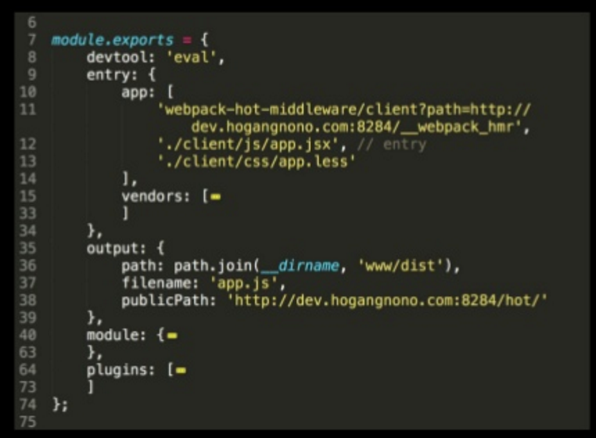
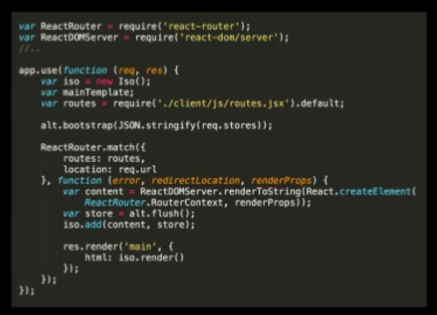

# React로 개발자 2명이 플랫폼 4개를 서비스하는 이야기
Speaker: 심상민 [호갱노노](https://hogangnono.com/) 창업자  
[발표자료](http://www.slideshare.net/deview/125react24)

2명의 창업자가 서버, 클라이언트, 데탑, 모바일웹, 모바일앱을 개발/유지보수하는 이야기

### React 선택 이유
* 렌더링 시점을 직접 제어하지 않아도 됨
* Virtual DOM으로 성능 확보
* *React hot loader* - 가장 끌린 이유

### phonegap에서 React-Hot-Loader적용하기
* 생산성이 정!말! 좋다
* 실제 디바이스에서 Charles나 Fiddler 등으로 프록시 사용
* localhost 대신 Hosts 파일 수정을 통해 개발 도메인으로 접근   
ex) 127.0.0.1 dev.hogangnono.com  
* webpack 설정에서 위의 도메인으로 모듈을 띄움  

[발표자료 17page](http://www.slideshare.net/deview/125react24)

### React-Router
* SPA로 만드니 라우터 필요
* Phonegap에서 사용시 Hash History방식을 사용해야함  
ex) index.html#/main

### Flux 구현체
* redux 출시되지 않아 Alt사용

### React Isomorphic
* SPA는 첫 페이지가 느리니 server-side-rendering로 해결
* 클라이언트의 Action, Store, Component코드를 서버에서 사용
* React-Router 코드를 서버에서 불러서 라우팅 처리
* Iso 모듈을 이용해서 클라이언트 코드로 렌더링 수행  

[발표자료 32page](http://www.slideshare.net/deview/125react24)
* 서버에서 실행할 수 없는 로직 분기처리  
ex) window.alert, window.confirm  
* 클라이언트/서버에서 동시에 쓸 수 있는 XMLHTTPRequest모듈 필요
* 404처리 - React-Router 로직 사용하기 전에 서버에서 해당 데이터(페이지)있는지 확인하여 처리

### 모바일앱
* phonegapp 사용
* why not use react native? 코드 하나로 재사용 해야해서
* React Native는 플러그인이 부족

### Native Page Transitions
* 네이티브 앱 같은 수준 나옴
* 기본 설정으로 사용하면 페이지 반복 호출 이슈 -> React-Router와 연계해서 트랜지션 타이밍 맞춰야함  
onEnter핸들러로 확인할 수 있음  
라우팅액션 -> Native Page Transition start() -> 라우팅완료 -> Native Page Transition execute()

### 더미노출
* ajax call하는 동안 더미 노출하여 네이티브 느낌으로

### 그밖에
* 기본 탑재 브라우저 성능 향상 가능  
안드로이드는 Crosswalk(쓰진않음), iOS는 Webview엔진

### for 멀티플랫폼
* 모바일앱/웹, 데스크탑, 서버.. x플랫폼수로 수정하지 않도록 잘 정리함.(나눌건 나누고 합칠건 합침)

### 정리
* node.js, React, Webpack, Phonegap, Alt, Iso등 사용

### Q&A
* 여러가지 플랫폼 운영하다 보면 코드 안정성 중요할 것 같은데.. 테스트케이스, QA 어떻게?  
할 수가 없없다.. 둘이 너무 바빴다. 대신 개발 환경을 잘 해놔서 개발자가 눈으로 보고 해결.
* 폰갭 위에서 SPA로 앱구성하면 성능이나 호환성 문제는 없었는지?  
별도의 wrapper 만들어 공통적인 부분 회피  
성능: 웹킷 웹뷰 도입하면 성능 좋아짐.
