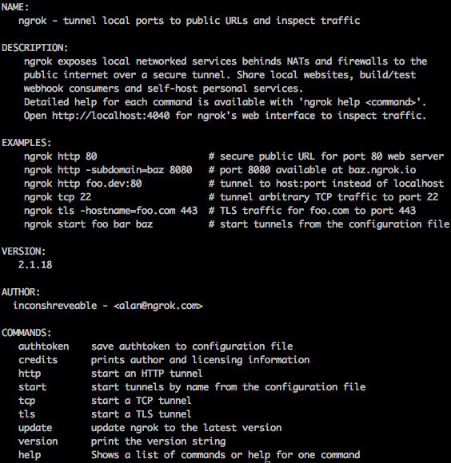
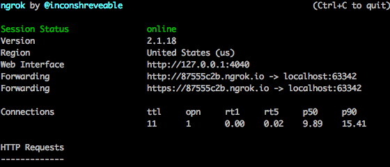

# Setup ngrok

### Install & Setup ngrok
Download: [ngrok](https://ngrok.com/)

```shell
# unzip to Applications
unzip /Applications

# cd into your local bin
cd /usr/local/bin

# create the symlink
ln -s /Applications/ngrok ngrok
```
now, you can use ngrok command

### ./ngrok help


### Example
connect local to ngrok
```shell
ngrok http 63342
```

**Result**  
  
You can access **http://87555c2b.ngrok.io** or **https://87555c2b.ngrok.io**

### References
* [ngrok으로 로컬 네트워크의 터널 열기](https://blog.outsider.ne.kr/1159)