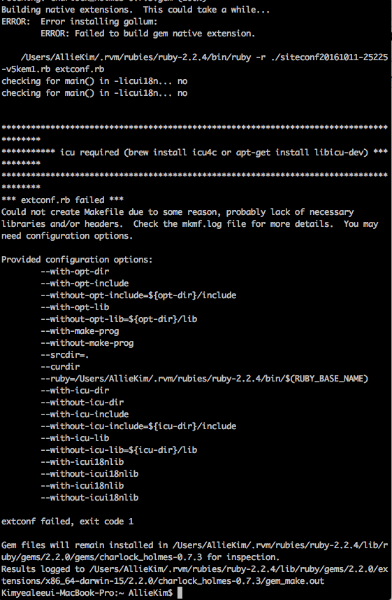

# Steup for TIL

### 1. Create local TIL folder
    $ cd ~
    $ mkdir TIL
    $ git init
    $ git remote add origin https://github.com/Allie-Kim/TIL.git
    

### 2. Install gollum
    $ sudo gem install gollum
[https://github.com/gollum](https://github.com/gollum/gollum/wiki/Installation)

#### error in my case

    $ brew install icu4c
    
#### continue installing..
    
    $ touch config.ru
    $ vi config.ru
    
    
#### paste following code in config.ru
    #!/usr/bin/env ruby
    require 'rubygems'
    require 'gollum/app'

    gollum_path = File.expand_path(File.dirname(__FILE__)) # CHANGE THIS TO POINT TO YOUR OWN WIKI REPO
    wiki_options = {:universal_toc => false}
    Precious::App.set(:gollum_path, gollum_path)
    Precious::App.set(:default_markup, :markdown) # set your favorite markup language
    Precious::App.set(:wiki_options, wiki_options)
    run Precious::App
[Gollum via Rack](https://github.com/gollum/gollum/wiki/Gollum-via-Rack)

### 3. Install pow
    $ curl get.pow.cx | sh
    $ cd ~/.pow
    $ ln -s /Users/AllieKim/TIL/ til.wiki
    
open [http://til.wiki.dev/](http://til.wiki.dev/)